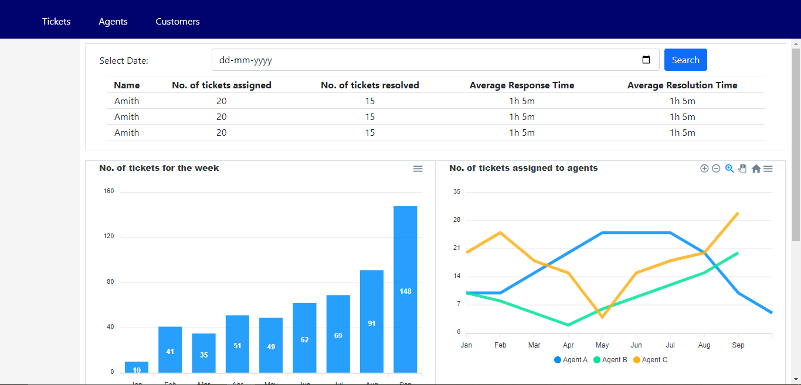
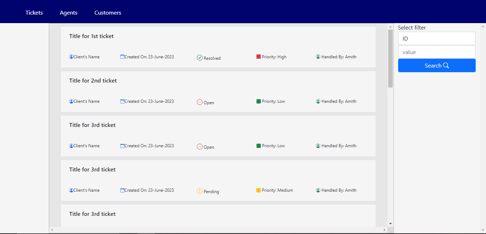

# CRM Application

## Summary
This is a CRM tool that allows a business's customer raise query/issue tickets which can be monitored by the business. Here there are 3 concepts: Admin, Agent and Customer.

## Functionalities
1. Admin

	- Get the performance of an agent on a day to day basis
	- Get information about the customers
	- Create tickets and assign to Agents
	- Create a new Agent profile
	- Filter and view all the tickets received
	- Comment on the tickets
	- Set configuration like: SLA metrics, Ticket categories, statuses, how they are assigned to agents

2. Agent
	- View list of tickets assigned to this agent
	- Filter out tickets based on certain parameters
	- Respond to the tickets, update status
	- Create tickets
	- Handover tickets to other agent
	- Mark status if available or not

3) Customer
	- View all tickets raised by him/her
	- Create ticket, respond and send feedback rating

### View of Admin dashboard to track Agent's performance

### View of Admin dashboard to monitor tickets created.

## Agent Peformance Metrics

1. Average Response Time:

Average Response Time for a ticket is the average of time duration between a customer's response and the immediate after response of the agent.

Average Response Time of an agent is the average of ART of all the tickets handled by him.
Overall Average Response Time of the support team is the average of ART of all the agents.
This can be calculated on a date basis (Average Response Time for each agent for a particular date).

2. Average Resolution Time:

The same concept of ART explained above, only change is the context of time is taken from resolution.

3. Agent CSAT

Average of the csat_rating for all tickets handled by the agent and where the customer has provided the rating. Note you must exclude the tickets where customer has not given the rating.

## Tech Stack:

- Front end: HTML, CSS, Bootstrap, Angular Framework
- Back end: Spring Boot, MySQL

